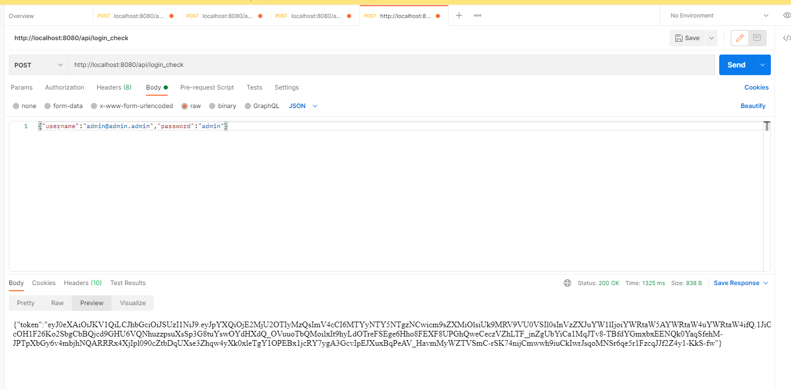
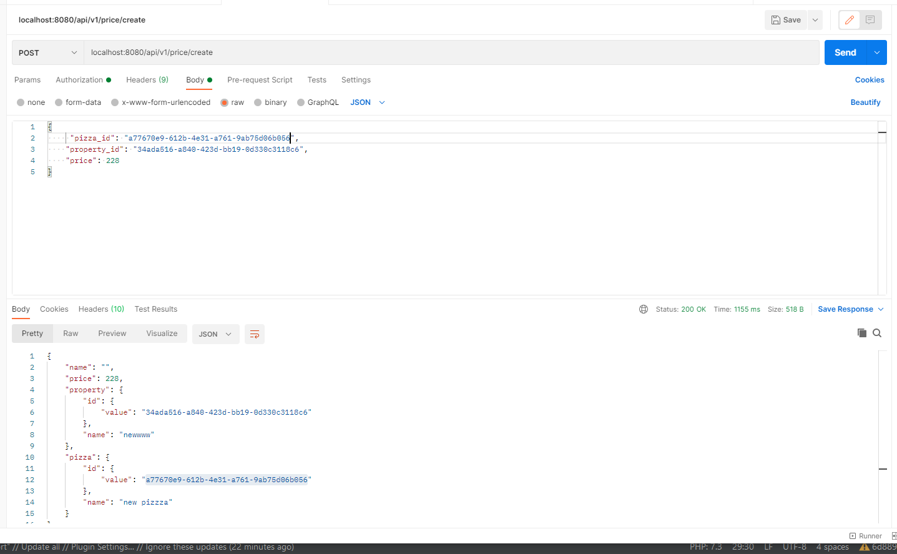
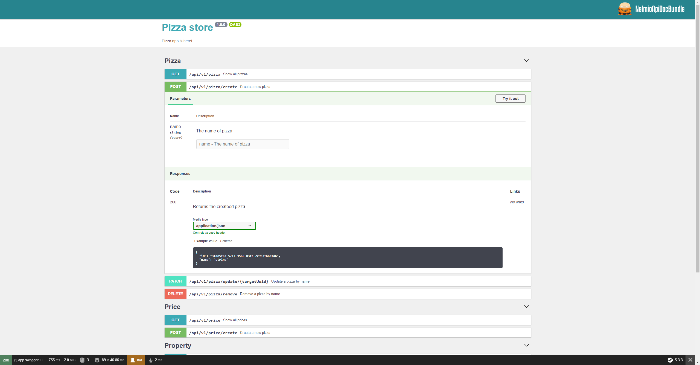
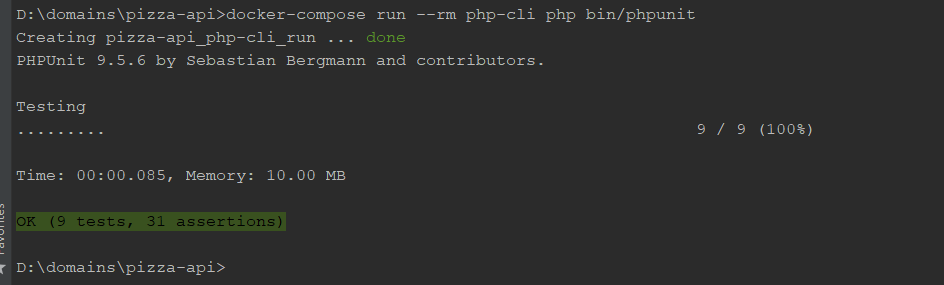

pizza-api is the REST API application for CRUD pizzas and set the prices

0. Clone this repo.
   
1. Composer install

   `docker-compose run --rm php-cli composer install`

2. Up the migrations

   `docker-compose run --rm php-cli php bin/console doc:mi:mi`

3. Load fixtures [optional]

   `docker-compose run --rm php-cli php bin/console doc:fixtures:load`

4. Generate SSL keys

   `docker-compose run --rm php-cli php bin/console lexik:jwt:generate-keypair`

5. First up docker

   `docker-compose up -d`
   
6. First send for obtain a token

POST http://localhost:8080/api/login_check 

`{"username":"admin@admin.admin","password":"admin"}`

You will receive something like:

7. Use this token as Bearer in Headers for requests

8. Api documents is available here `http://localhost:8080/api/doc`

9. Unit tests `docker-compose run --rm php-cli php bin/phpunit`

